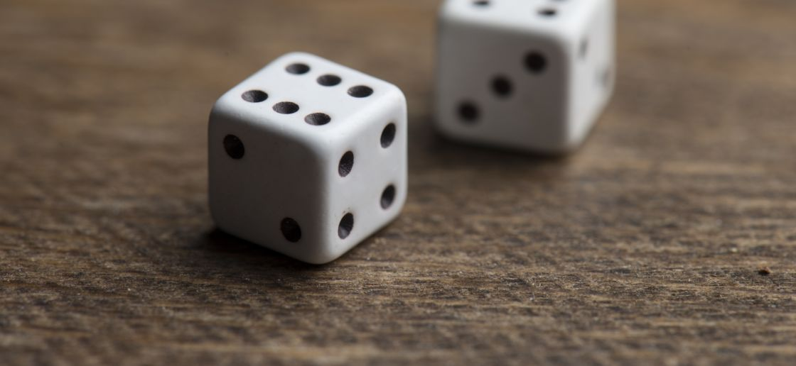

# EX2, La revanche de la chance



Après avoir perdu la moitié de son argent de poche, Bob décide de corser le jeu. Il sort un deuxième dés
à 6 faces de sa poche et propose le jeu suivant à Alice : 

"Voici les règles", dit Bob. "Je vais lancer ces deux dés, et tu vas me dire la probabilité que j'ai d'obtenir
un chiffre inférieur ou égal à un nombre donné n. Si tu as raison, je te donne 10 dollars. Si tu as
tort, tu me rends 10 dollars."

## Input
```
M le nombre de tests, 0 < M <= 10^5
M lignes contenant un entier N, 0 < N <= 12
```
## Output
```
M lignes contenant : Bob a <P> de gagner
où
P la probabilité d'obtenir un chiffre inférieur ou égal à N en fraction irréductible
```
## Time limit
```
1 sec
```

# Exemple :
## Input
```
4
2
4
6
8
```

## Output
```
Bob a 1/36 de gagner
Bob a 1/6 de gagner
Bob a 5/12 de gagner
Bob a 13/18 de gagner
```